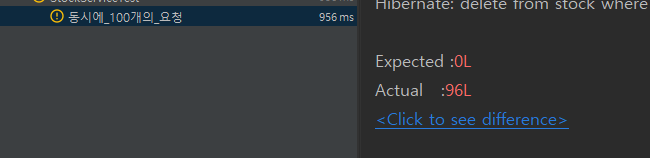

# 재고시스템으로 알아보는 동시성 이슈 해결하기

### Entity

```java
@Entity
@Getter
@NoArgsConstructor(access = AccessLevel.PROTECTED)
public class Stock {

	@Id @GeneratedValue(strategy = GenerationType.IDENTITY)
	private Long id;

	private Long productId;

	private Long quantity;

	public Stock(Long productId, Long quantity) {
		this.productId = productId;
		this.quantity = quantity;
	}

	public void decrease(Long quantity) {
		if (this.quantity - quantity < 0) {
			throw new IllegalArgumentException("재고는 0개 미만이 될 수 없습니다.");
		}
		this.quantity -= quantity;
	}
}

```

### Service

```java
@Service
@RequiredArgsConstructor
public class StockService {

	private final StockRepository stockRepository;

	@Transactional
	public void decrease(Long id, Long quantity) {
		Stock stock = stockRepository.findById(id)
			.orElseThrow(() -> new IllegalArgumentException("Stock not found"));

		stock.decrease(quantity);
		stockRepository.save(stock);
	}
}

```

### Test Code

```java
	@Test
	public void 동시에_100개의_요청() throws InterruptedException{
		int threadCount = 100;
		ExecutorService executorService = Executors.newFixedThreadPool(32);
		CountDownLatch latch = new CountDownLatch(threadCount);

		for (int i = 0; i < threadCount; i++) {
			executorService.execute(() -> {
				try {
					stockService.decrease(1L, 1L);
				} finally {
					latch.countDown();
				}
			});
		}
		latch.await();

		Stock stock = stockRepository.findById(1L).orElseThrow(() -> new IllegalArgumentException("재고가 없습니다."));

		Assertions.assertThat(stock.getQuantity()).isEqualTo(0L);
	}
```



100번의 decrease를 했지만 재고가 남은 재고가 96개인 현상 발생  → 동시성 이슈(Concurrency Issue) 발생 


Race Condition (경쟁 상태)

두 개 이상의 Thread가 공유 데이터 엑세스를 할 수 있고 동시에 변경을 하려할 때 발생 

→ 하나의 쓰레드가 작업이 완료된 이후에 다른 쓰레드가 데이터에 접근 할 수 있도록 하여 해결 

### synchronized 사용

```java
	@Transactional
	public synchronized void  decrease(Long id, Long quantity) {
		Stock stock = stockRepository.findById(id)
			.orElseThrow(() -> new IllegalArgumentException("Stock not found"));

		stock.decrease(quantity);
		stockRepository.save(stock);
	}
```

synchronized를 메서드 선언부에 붙여주면 해당 메서드는 한개의 쓰레드만 접근 가능 


synchronized를 사용하여도 테스트 실패 

스프링의 @Transcational의 동장 방식 때문 → 우리가 만든 클래스를 래핑한 클래스를 새로 만들어서 실행 

동작 방식 

```java
@Service
@RequiredArgsConstructor
public class TransactionStockService {

	private final StockService stockService;
	
	@Transactional
	public void decrease(Long id, Long quantity) {
		startTransaction();
		
		stockService.decrease(id, quantity);
		
		endTransaction();
	}
	private void startTransaction() {
		System.out.println("Transaction started");
	}
	private void endTransaction() {
		System.out.println("Transaction ended");
	}
}
```

StockService를 필드로 갖는 클래스를 새로 만들어 실행 

문제 → 트랜젝션 종료시점에 DB에 업데이트 

DB가 업데이트 되기 전에 다른 쓰래드가 stockService.decrease() 호출 가능 

```java
	// @Transactional
	public synchronized void  decrease(Long id, Long quantity) {
		Stock stock = stockRepository.findById(id)
			.orElseThrow(() -> new IllegalArgumentException("Stock not found"));

		stock.decrease(quantity);
		stockRepository.save(stock);
	}
```

@Transactional 어노테이션을 주석 처리하여 해결 가능

### synchronized를 이용했을 때 발생할 수 있는 문제


스프링 프로세스 하나에서 처리하는 동시성 해결이므로 서버가 여러대라면 Race Condition 발생 

synchronized 거의 사용 X 

### DB를 활용한 다양한 해결 방법

### 1. Pessimistic Lock(비관적 락)

- 실제로 데이터에 Lock을 걸어 정합성을 맞추는 방법, exclusive lock을 걸게되면 다른 트랜잭션에서는 lock이 해제되기전에 데이터를 가져갈 수 없게된다 → 데드락이 발생할 수도 있다.


### 2. Optimistic Lock(낙관적 락)

- 실제 Lock을 이용하지 않고 버전을 이용함으로써 정합성을 맞추는 방법 먼저 데이터를 읽은 후에 update를 수행할 때 현재 내가 읽은 버전이 맞는지 확인하며 업데이트를 수행 내가 읽은 버전에서 수정사항이 생겼을 경우에는 application에서 다시 읽은 후에 작업을 수행해야 한다.


### 3. Named Lock(분산 락)

- 이름을 가진 metadata locking, 이름을 가진 lock을 획득한 후 해제할 때까지 다른 세션은 이 lock을 획득할 수 없도록 한다. 주의 할 점으로는 transaction이 종료될 때 lock이 자동으로 해제되지 않으므로 별도의 명령어로 해제를 수행하거나 선점시간이 끝나야 해제된다.

Pessimistic Lock과 유사하지만 row, 나 table 단위로 락을 거는게 아니라 메타 데이터에 락을 거는 방식 

### Pessimistic Lock을 이용해 동시성 해결


 

```java
@Test
	public void 비관적락_동시에_100개의_요청() throws InterruptedException{
		int threadCount = 100;
		ExecutorService executorService = Executors.newFixedThreadPool(32);
		CountDownLatch latch = new CountDownLatch(threadCount);

		for (int i = 0; i < threadCount; i++) {
			executorService.execute(() -> {
				try {
					perssimisticLockStockService.decrease(1L, 1L);
				} finally {
					latch.countDown();
				}
			});
		}
		latch.await();

		Stock stock = stockRepository.findById(1L).orElseThrow(() -> new IllegalArgumentException("재고가 없습니다."));

		Assertions.assertThat(stock.getQuantity()).isEqualTo(0L);
	}
```

```java
public interface StockRepository extends JpaRepository<Stock, Long> {

	@Lock(LockModeType.PESSIMISTIC_WRITE)
	@Query("SELECT s FROM Stock s WHERE s.id = :id")
	Stock findByIdWithPessimisticLock(Long id);

}
```


for update → 락을 걸고 데이터를 가져오는 부분 

충돌이 빈번하게 일어난다면 Optimistic lock(낙관적 락) 보다 성능이 좋을 수 있다.

락을 통해 Update를 제어하기 때문에 데이터 정합성 보장 

But 성능 저하 

### Optimistic Lock을 이용하여 동시성 해결


Service

```java
@Service
@RequiredArgsConstructor
public class OptimisticLockStockService {

	private final StockRepository stockRepository;

	@Transactional
	public void decrease(Long id, Long quantity) {
		Stock stock = stockRepository.findByIdWithOptimisticLock(id);

		stock.decrease(quantity);

		stockRepository.save(stock);
	}
}

```

Repository

```java
public interface StockRepository extends JpaRepository<Stock, Long> {

	@Lock(LockModeType.PESSIMISTIC_WRITE)
	@Query("SELECT s FROM Stock s WHERE s.id = :id")
	Stock findByIdWithPessimisticLock(Long id);

	@Lock(LockModeType.OPTIMISTIC)
	@Query("SELECT s FROM Stock s WHERE s.id = :id")
	Stock findByIdWithOptimisticLock(Long id);
}
```

Facade

```java
@Component
@RequiredArgsConstructor
public class OptimistickLockStockFacade {

	private final OptimisticLockStockService optimisticLockStockService;

	public void decrease(Long id, Long quantity) throws InterruptedException {
		while (true){
			try {
				optimisticLockStockService.decrease(id, quantity);
				break;
			} catch (Exception e) {
				Thread.sleep(50);
			}
		}
	}
}
```

Test

```java
	@Test
	public void 낙관적락_동시에_100개의_요청() throws InterruptedException{
		int threadCount = 100;
		ExecutorService executorService = Executors.newFixedThreadPool(32);
		CountDownLatch latch = new CountDownLatch(threadCount);

		for (int i = 0; i < threadCount; i++) {
			executorService.execute(() -> {
				try {
					optimistickLockStockFacade.decrease(1L, 1L);
				} catch (InterruptedException e) {
					throw new RuntimeException(e);
				} finally {
					latch.countDown();
				}
			});
		}
		latch.await();

		Stock stock = stockRepository.findById(1L).orElseThrow(() -> new IllegalArgumentException("재고가 없습니다."));

		Assertions.assertThat(stock.getQuantity()).isEqualTo(0L);
	}
```


별도의 락을 잡지 않으므로 Pessimistic Lock보다 성능 상 이점이 있음 

업데이트가 실패 했을 때 재시도 로직을 개발자가 직접 작성해줘야하는 번거로움이 있음 

충돌이 빈번하게 일어날 것으로 예상되면 Pessimistic Lock을 추천

### Named Lock(분산 락)  - Mysql 사용


Facade

```java
@Component
@RequiredArgsConstructor
public class NamedLockStockFacade {

	private final LockRepository lockRepository;

	private final NamedLockStockService namedLockStockService;

	@Transactional
	public void decrease(Long id, Long quantity) {
		try{
			lockRepository.getLock(id.toString());
			namedLockStockService.decrease(id, quantity);
		} finally {
			lockRepository.releaseLock(id.toString());
		}
	}
}
```

Service 

```java
@Service
@RequiredArgsConstructor
public class NamedLockStockService {

	private final StockRepository stockRepository;

	@Transactional(propagation = Propagation.REQUIRES_NEW)
	public void  decrease(Long id, Long quantity) {
		Stock stock = stockRepository.findById(id)
			.orElseThrow(() -> new IllegalArgumentException("Stock not found"));
		stock.decrease(quantity);

		stockRepository.save(stock);
	}
}
```

LockRepository

```java
public interface LockRepository extends JpaRepository<Stock, Long> {
	@Query(value = "select get_lock(:key, 3000)", nativeQuery = true)
	void getLock(String key);

	@Query(value = "select release_lock(:key)", nativeQuery = true)
	void releaseLock(String key);
}
```

Test Code

```java
	@Test
	public void 네임드_락_동시에_100개의_요청() throws InterruptedException{
		int threadCount = 100;
		ExecutorService executorService = Executors.newFixedThreadPool(32);
		CountDownLatch latch = new CountDownLatch(threadCount);

		for (int i = 0; i < threadCount; i++) {
			executorService.execute(() -> {
				try {
					namedLockStockFacade.decrease(1L, 1L);
				} finally {
					latch.countDown();
				}
			});
		}
		latch.await();

		Stock stock = stockRepository.findById(1L).orElseThrow(() -> new IllegalArgumentException("재고가 없습니다."));

		Assertions.assertThat(stock.getQuantity()).isEqualTo(0L);
	}
```


주로 분산락을 구현할 때 사용 

Pessimistic Lock은 Time Out을 구현하기 힘들지만 Named Lock은 구현이 쉽다 

데이터 삽입 시 정합성을 맞춰야하는 경우에도 Named Lock을 사용 가능 

but 트랜잭션 종료 시에 락 해제 세션 관리를 잘 해줘야하기 때문에 주의해서 사용해야 하며 실제 사용 시 구현 방법이 복잡할 수도 있음 

### Named Lock(분산 락)  - Redis 사용

분산 락을 구현하는 대표적인 라이브러리 

- Lettuce
    - setnx(set if not exist → 기존의 값이 없을 때만 set) 명령어를 활용하여 분산락 구현
    - spin lock 방식 → retry로직 개발자가 직접 작성해야함.  → lock을 획득하려는 쓰레드가 lock을 사용할 수 있는지 반복적으로 확인하며 lock획득 시도


- Redisson
    - pus-sub 기반으로 Lock 구현 제공  →  채널을 만들고 lock을 점유중인 쓰레드가 lock 획득 대기 쓰레드에게 해제를 알려줌으로 안내를 받은 쓰레드가 락 획득
        - 별도의 retry 로직 작성이 필요없음.


### Lettuce를 이용한 Named Lock

Facade

```java
@Component
@RequiredArgsConstructor
public class LettuceLockStockFacade {

	private final RedisLockRepository redisLockRepository;
	private final StockService stockService;

	public void decrease(Long id, Long quantity) throws InterruptedException {
		while (!redisLockRepository.lock(id)) {
			Thread.sleep(100);
		}
		try {
			stockService.decrease(id, quantity);
		} finally {
			redisLockRepository.unlock(id);
		}
	}
}
```

RedisLockRepository

```java
@Component
@RequiredArgsConstructor
public class RedisLockRepository {

	private final RedisTemplate<String, String> redisTemplate;

	public boolean lock(Long key) {
		return redisTemplate
			.opsForValue()
			.setIfAbsent(generateKey(key), "lock", Duration.ofMillis(3_000));
	}

	public boolean unlock(Long key) {
		return redisTemplate.delete(generateKey(key));
	}

	private String generateKey(Long key) {
		return key.toString();
	}
}
```


구현이 간단하다 But 스핀 락 방식이므로 레디스에 부하를 줄 수 있다. 

Thread Sleep을 통해 락 획득 재시도 간에 텀을 둬야한다. 

### Redisson을 활용한 Named Lock


다음과 같이 pub/sub 활용 

```java
// redisson 의존성 추가
implementation group: 'org.redisson', name: 'redisson-spring-boot-starter', version: '3.37.0'
```

Facade

```java
@Component
@RequiredArgsConstructor
public class RedissonLockStockFacade {

	private final RedissonClient redissonClient;

	private final StockService stockService;

	public void decrease(Long id, Long quantity) {
		RLock lock = redissonClient.getLock(id.toString());

		try{
			boolean available = lock.tryLock(10, 1, TimeUnit.SECONDS);

			if (!available){
				System.out.println("lock 획득 실패");
				return;
			}

			stockService.decrease(id, quantity);
		} catch (InterruptedException e) {
			throw new RuntimeException(e);
		} finally {
			lock.unlock();
		}
	}
}

```

pub/sub 기반의 구현이므로 redis의 부하를 줄여준다 .

but 구현이 살짝 복잡하고 별도의 라이브러리를 사용해야하는 부담이 있다.

- Rettuce
    - 구현이 간단
    - Spring data redis의 기본 라이브러리이므로 별도 라이브러리 사용 X
    - Spin Lock 방식이기때문에 동시에 많은 스레드가 lock 획득 대기 상태라면 redis에 부하가 갈 수 있음
- Redisson
    - 락 획득 재시도를 기본으로 제공
    - pub-sub 방식으로 구현되어 있기 떄문에 Lettuce에 비해 Redis에 부하가 덜 함
    - 별도의 라이브러리를 사용해야함
    - lock을 라이브러리 차원에서 제공해주기 때문에 사용법을 학습해야함

→ 재시도가 필요하지 않은 lock은 lettuce을 활용

→ 재시도가 필요한 경우에는 redisson을 활용